---
## Front matter
title: "Отчёт по лабораторной работе №1"
subtitle: "Операционные системы"
author: "Софич Андрей Геннадьевич"

## Generic otions
lang: ru-RU
toc-title: "Содержание"

## Bibliography
bibliography: bib/cite.bib
csl: pandoc/csl/gost-r-7-0-5-2008-numeric.csl

## Pdf output format
toc: true # Table of contents
toc-depth: 2
lof: true # List of figures
fontsize: 12pt
linestretch: 1.5
papersize: a4
documentclass: scrreprt
## I18n polyglossia
polyglossia-lang:
  name: russian
  options:
	- spelling=modern
	- babelshorthands=true
polyglossia-otherlangs:
  name: english
## I18n babel
babel-lang: russian
babel-otherlangs: english
## Fonts
mainfont: PT Serif
romanfont: PT Serif
sansfont: PT Sans
monofont: PT Mono
mainfontoptions: Ligatures=TeX
romanfontoptions: Ligatures=TeX
sansfontoptions: Ligatures=TeX,Scale=MatchLowercase
monofontoptions: Scale=MatchLowercase,Scale=0.9
## Biblatex
biblatex: true
biblio-style: "gost-numeric"
biblatexoptions:
  - parentracker=true
  - backend=biber
  - hyperref=auto
  - language=auto
  - autolang=other*
  - citestyle=gost-numeric
## Pandoc-crossref LaTeX customization
figureTitle: "Рис."
tableTitle: "Таблица"
listingTitle: "Листинг"
lofTitle: "Список иллюстраций"
lolTitle: "Листинги"
## Misc options
indent: true
header-includes:
  - \usepackage{indentfirst}
  - \usepackage{float} # keep figures where there are in the text
  - \floatplacement{figure}{H} # keep figures where there are in the text
---

# Цель работы

Целью работы является приобретение практических навыков установки операционной системы на виртуальную машину, настройки минимально неободимых для дальнейешей работы сервисов.

# Задание

1.Создание виртуальной машины
2.Установка операционной системы
3.Работа с операционной системой после установки
4.Установка програмного обеспечения

# Выполнение лабораторной работы
##Создание виртуальной машины

Создаю виртуальную машину, на системе Linux, называю свою систему (рис. [-@fig:001]).

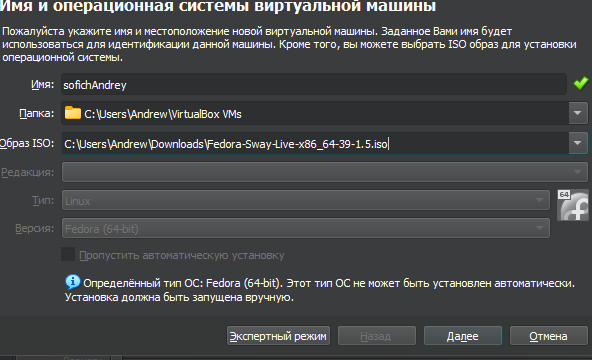{#fig:001 width=70%}

Выделяю оперативную память, процессоры и 80 гб памяти (рис. [-@fig:002]).

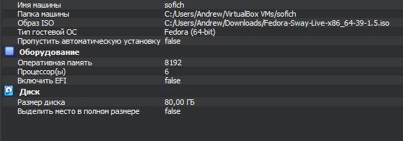{#fig:002 width=70%}

Запускаю машину (рис. [-@fig:003]).

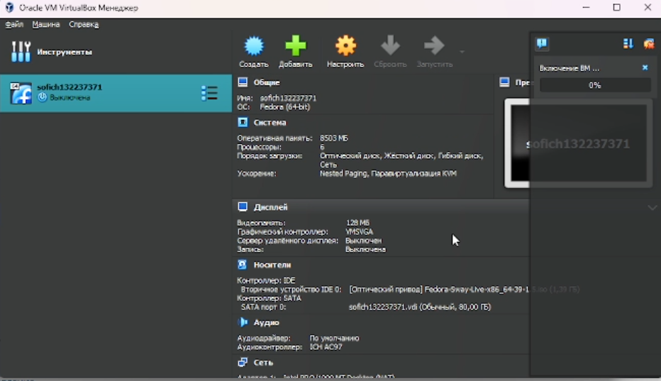{#fig:003 width=70%}

##Установка операционной системы

После запуска системы, нажимаю сочетание win+d, liveinst, ввожу основные настройки машины(язык,пароль), включаю загрузку системы. (рис. [-@fig:004]).

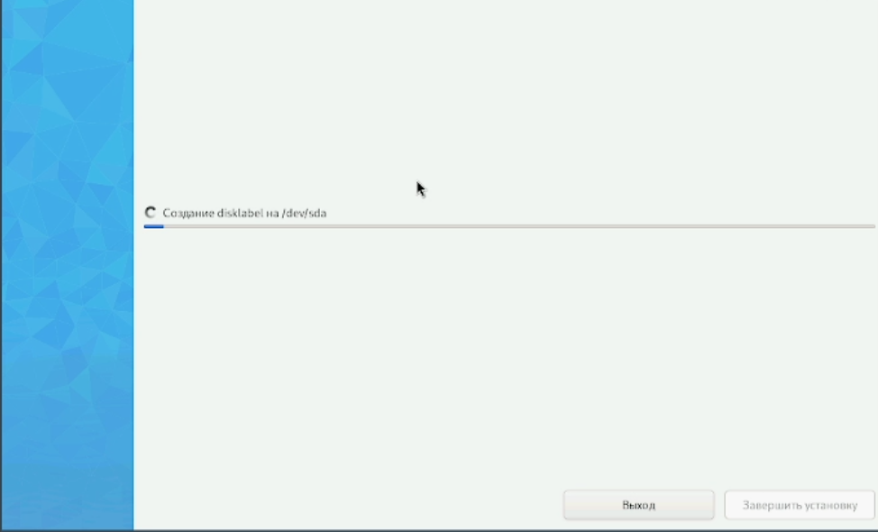{#fig:004 width=70%} 

После установки изымаю оптический диск (рис. [-@fig:005]).

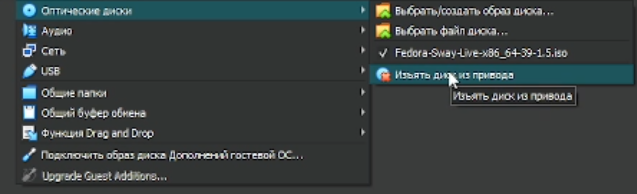{#fig:005 width=70%} 

##Работа с операционной системой после установки

Запускаю систему, захожу в терминал и обновляю все пакеты (рис. [-@fig:006]).

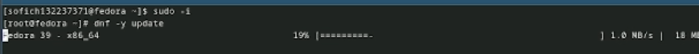{#fig:006 width=70%} 

Устанавливаю программы для автоматического обновления (рис. [-@fig:007]).

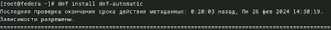{#fig:007 width=70%} 

Запускаю таймер (рис. [-@fig:008]).

##Установка програмного обеспечения

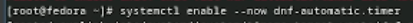{#fig:008 width=70%}

Перемещаюсь в директорию /etc/selinux, открываю md, ищу файл (рис. [-@fig:009]).

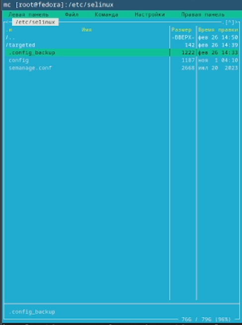{#fig:009 width=70%}

Изменяю открытый файл: Selinux=enforcing меня на Selinux=permissive (рис. [-@fig:010]).

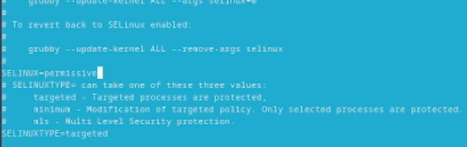{#fig:010 width=70%}

Устанавливаю средства разработки (рис. [-@fig:011]).

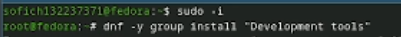{#fig:011 width=70%}

Подключаю образ диска дополнительной гостевой ОС (рис. [-@fig:012]).

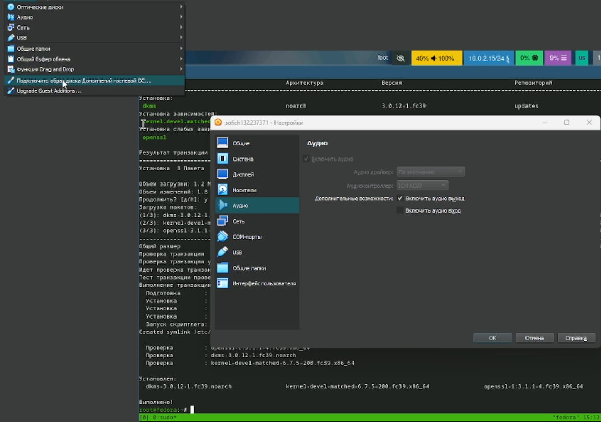{#fig:012 width=70%}

Монтирую диск (рис. [-@fig:013]).

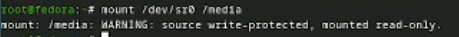{#fig:013 width=70%}

Устанавливаю драйвера (рис. [-@fig:014]).

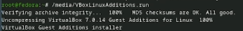{#fig:014 width=70%}

Переустанавливаю систему (рис. [-@fig:015]).

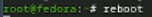{#fig:015 width=70%}

Переконфигурирую раскладку клавиатуры, создаю конфигурационный файл и  редактирую его (рис. [-@fig:016]).

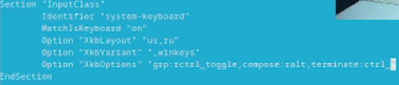{#fig:016 width=70%}

Устанавливаю pandoc (рис. [-@fig:017]).

{#fig:017 width=70%}

Устанавливаю Texlive (рис. [-@fig:018]).

{#fig:018 width=70%}

# Выводы

При выполнении работы я приобрел практические навыки установки на виртуальную машину и сделал настройки, необходимые для работы сервисов.

# Список литературы{.unnumbered}

::: лабораторная работа №1
:::
