---
## Front matter
lang: ru-RU
title: Презентация по лабораторной работе №4
subtitle: Продвинутое использование git
author:
  - Софич А.С
institute:
  - Российский университет дружбы народов, Москва, Россия
  - НКАбд-05-23
date: 04 марта 2024

## i18n babel
babel-lang: russian
babel-otherlangs: english

## Formatting pdf
toc: false
toc-title: Содержание
slide_level: 2
aspectratio: 169
section-titles: true
theme: metropolis
header-includes:
 - \metroset{progressbar=frametitle,sectionpage=progressbar,numbering=fraction}
 - '\makeatletter'
 - '\beamer@ignorenonframefalse'
 - '\makeatother'

## Fonts
mainfont: PT Serif
romanfont: PT Serif
sansfont: PT Sans
monofont: PT Mono
mainfontoptions: Ligatures=TeX
romanfontoptions: Ligatures=TeX
sansfontoptions: Ligatures=TeX,Scale=MatchLowercase
monofontoptions: Scale=MatchLowercase,Scale=0.9
---

## Докладчик

:::::::::::::: {.columns align=center}
::: {.column width="70%"}

  * Софич Андрей Геннадьевич
  * Студент
  * НКАбд-05-23
  * Российский университет дружбы народов
  * [1132237371@pfur.ru](mailto:1132237371@rudn.ru)

:::
::: {.column width="30%"}

:::
::::::::::::::

## Цели и задачи

Получение навыков правильной работы с репозиториями git

# Выполнение лабораторной работы

## 

Устанавливаю gitflow 

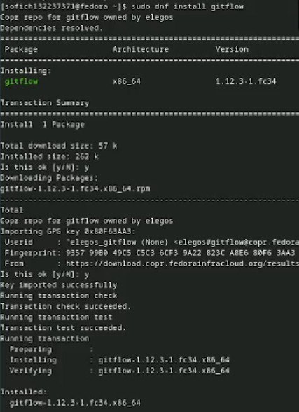

## 

Для работы с NODE.JS добавим каталог с исполняемыми файлами. Запускаю, используя команду pnpm setup 

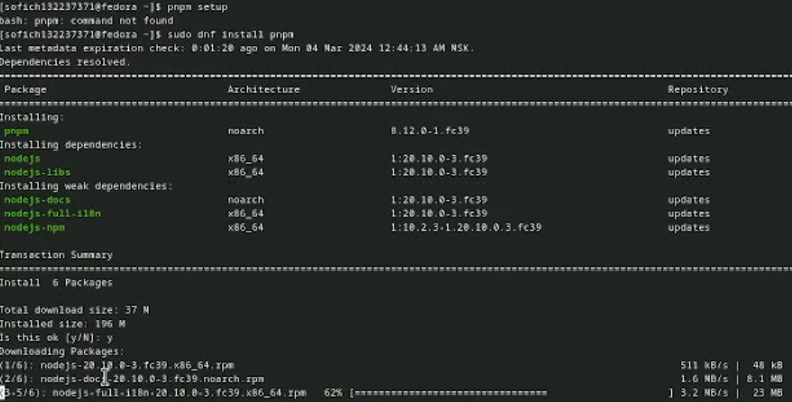

## 

Создаю пустой файл в новый репозиторий, делаю первый коммит и выкладываю на github 

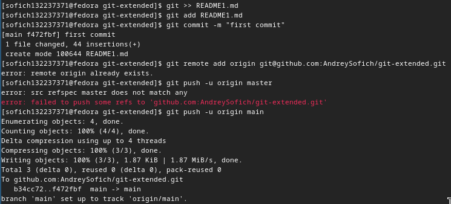

##

Выполняю конфигурацию для пакетов NODE.js 

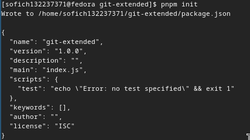

##

Добавляю новый файлы,выполняю коммит и отправляю изменения на github 

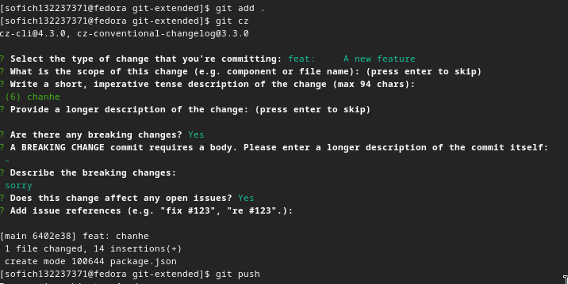

##

Инициализирую gitflow, префикс для ярлыков устанавливаю в v 

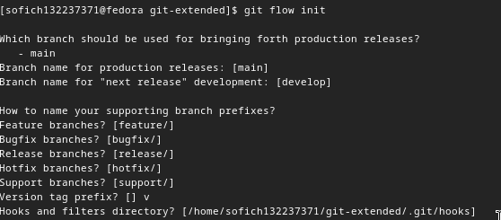

## 

Проверяю,что нахожусь на ветке develop и отправляю весь репозиторий в хранилище 

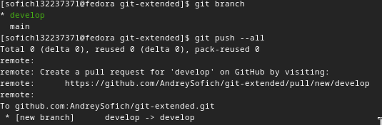

##

Уставливаю внешнюю ветку как вышестоящую для этой ветке 

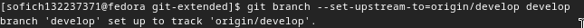

##

Cоздаю релиз с версией 1.0.0 

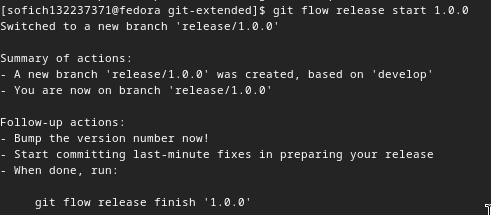

##

Cоздаю журнал изменений и добавляю его в индекс 

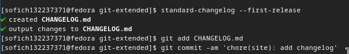

##

Заливаю релизную ветку в основную ветку 

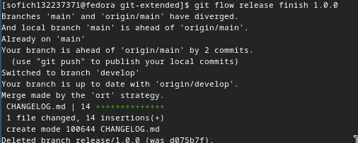

##

Отправляю данные на github 

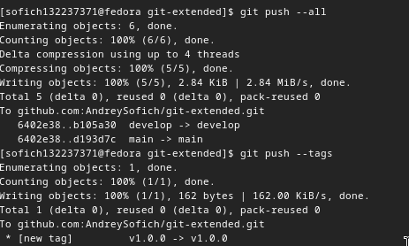

##

Создаю релиз на GitHub 

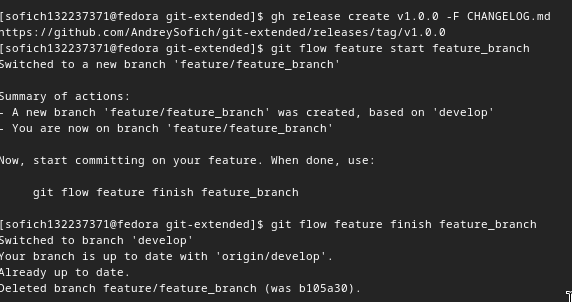

##

Создаю ветку для новой функциональности 

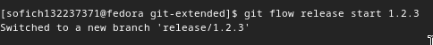

##

Обновляю файл package.json и создаю журнал изменений, добавляю журнал в индекс и заливаю ветку в основную 

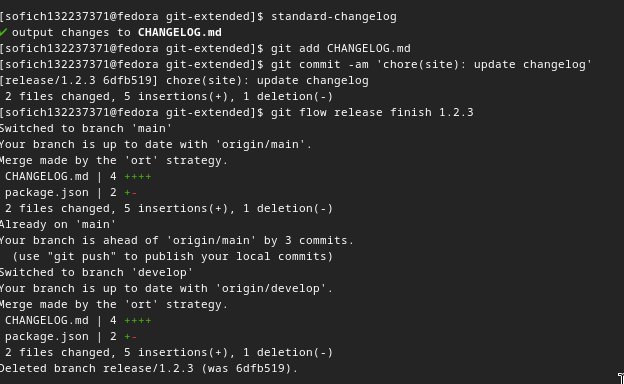

##

Отправляю данные на github 

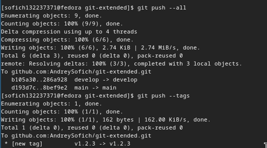

##

Cоздаю релиз на GitHub с комментарием из журнала изменений 

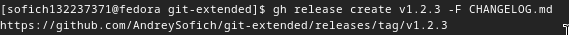

## Выводы

В ходе работы я получение навыков правильной работы с репозиториями git

