---
## Front matter
lang: ru-RU
title: Презентация по лабораторной работе №5
subtitle: Настройка рабочей среды
author:
  - Софич А.С
institute:
  - Российский университет дружбы народов, Москва, Россия
  - НКАбд-05-23
date: 04 марта 2024

## i18n babel
babel-lang: russian
babel-otherlangs: english

## Formatting pdf
toc: false
toc-title: Содержание
slide_level: 2
aspectratio: 169
section-titles: true
theme: metropolis
header-includes:
 - \metroset{progressbar=frametitle,sectionpage=progressbar,numbering=fraction}
 - '\makeatletter'
 - '\beamer@ignorenonframefalse'
 - '\makeatother'

## Fonts
mainfont: PT Serif
romanfont: PT Serif
sansfont: PT Sans
monofont: PT Mono
mainfontoptions: Ligatures=TeX
romanfontoptions: Ligatures=TeX
sansfontoptions: Ligatures=TeX,Scale=MatchLowercase
monofontoptions: Scale=MatchLowercase,Scale=0.9
---

## Докладчик

:::::::::::::: {.columns align=center}
::: {.column width="70%"}

  * Софич Андрей Геннадьевич
  * Студент
  * НКАбд-05-23
  * Российский университет дружбы народов
  * [1132237371@pfur.ru](mailto:1132237371@rudn.ru)

:::
::: {.column width="30%"}

:::
::::::::::::::

## Цели и задачи

Настроить рабочую среду

# Выполнение лабораторной работы

## 

Устанавливаю менеджер паролей pass

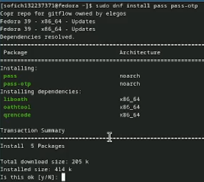

## 

Устанавливаю gopass

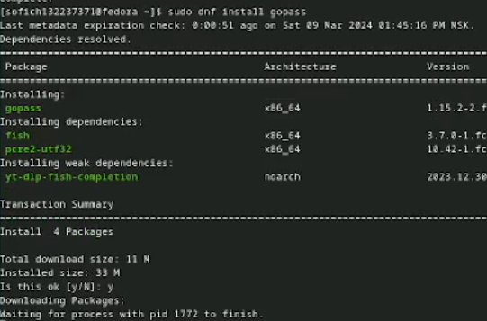

## 

Просматриваю список ключей

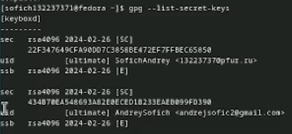

##

Инициализирую хранилище 

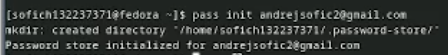

##

Создаю структуру git 

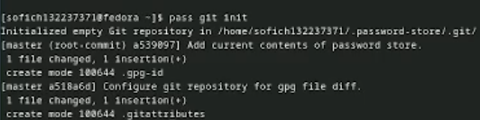

##

Создаю репозиторий, задаю адрес на хостинге, синхранизирую и создаю изменения в файловой системе 

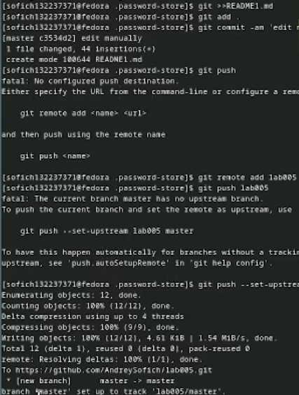

## 

Устанавливаю программу, обеспечивающую интерфейс native messaging

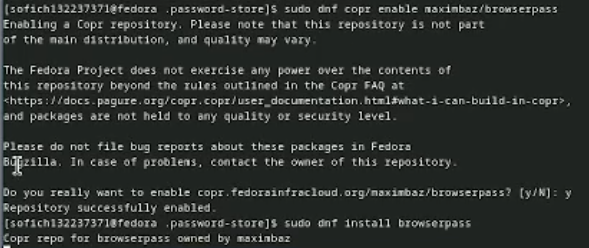

##

Устанавливаю дополнительное программное обеспечение

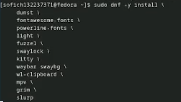

##

Устанавливаю шрифты

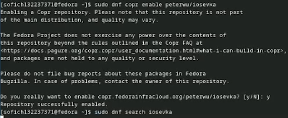

##

Устанавливаю бинарный файл и создаю репозиторий на основе шаблона 

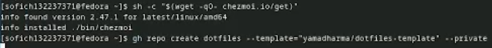

##

Инициализирую chezmoi с репозиторием dotfiles 

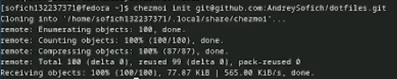

##

Проверяю изменение,которые внесет chezmoi

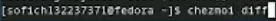

##

Меня устраивают изменения,поэтому запускаю chezmoi apply

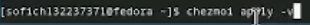

##

Извлекаю изменения и применяю их, смотрю,что изменится,не примененяя изменения

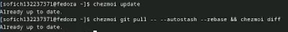

##

Включаю функцию,которая может автоматически отправлять изменения в исходный каталог в репозиторий 

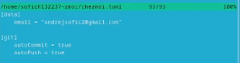

## Выводы

Я настроил рабочую среду

