---
## Front matter
lang: ru-RU
title: Презентация по лабораторной работе №7
author:
  - Софич А.С
institute:
  - Российский университет дружбы народов, Москва, Россия
  - НКАбд-05-23
date: 04 марта 2024

## i18n babel
babel-lang: russian
babel-otherlangs: english

## Formatting pdf
toc: false
toc-title: Содержание
slide_level: 2
aspectratio: 169
section-titles: true
theme: metropolis
header-includes:
 - \metroset{progressbar=frametitle,sectionpage=progressbar,numbering=fraction}
 - '\makeatletter'
 - '\beamer@ignorenonframefalse'
 - '\makeatother'

## Fonts
mainfont: PT Serif
romanfont: PT Serif
sansfont: PT Sans
monofont: PT Mono
mainfontoptions: Ligatures=TeX
romanfontoptions: Ligatures=TeX
sansfontoptions: Ligatures=TeX,Scale=MatchLowercase
monofontoptions: Scale=MatchLowercase,Scale=0.9
---

## Докладчик

:::::::::::::: {.columns align=center}
::: {.column width="70%"}

  * Софич Андрей Геннадьевич
  * Студент
  * НКАбд-05-23
  * Российский университет дружбы народов
  * [1132237371@pfur.ru](mailto:1132237371@rudn.ru)

:::
::: {.column width="30%"}

:::
::::::::::::::

## Цели и задачи

Приобретение практических навыков взаимодействия пользователя с системой посредством командной строки.

# Задание 

##

1. Определите полное имя вашего домашнего каталога. Далее относительно этого ката-
лога будут выполняться последующие упражнения.
2. Выполните следующие действия:
2.1. Перейдите в каталог /tmp.
2.2. Выведите на экран содержимое каталога /tmp. Для этого используйте команду ls
с различными опциями. Поясните разницу в выводимой на экран информации.
2.3. Определите, есть ли в каталоге /var/spool подкаталог с именем cron?
2.4. Перейдите в Ваш домашний каталог и выведите на экран его содержимое. Опре-
делите, кто является владельцем файлов и подкаталогов?
3. Выполните следующие действия:
3.1. В домашнем каталоге создайте новый каталог с именем newdir.
3.2. В каталоге ~/newdir создайте новый каталог с именем morefun.
3.3. В домашнем каталоге создайте одной командой три новых каталога с именами
letters, memos, misk. Затем удалите эти каталоги одной командой.
3.4. Попробуйте удалить ранее созданный каталог ~/newdir командой rm. Проверьте,
был ли каталог удалён.
3.5. Удалите каталог ~/newdir/morefun из домашнего каталога. Проверьте, был ли
каталог удалён.
4. С помощью команды man определите, какую опцию команды ls нужно использо-
вать для просмотра содержимое не только указанного каталога, но и подкаталогов,
входящих в него.
5. С помощью команды man определите набор опций команды ls, позволяющий отсорти-
ровать по времени последнего изменения выводимый список содержимого каталога
с развёрнутым описанием файлов.
6. Используйте команду man для просмотра описания следующих команд: cd, pwd, mkdir,
rmdir, rm. Поясните основные опции этих команд.
7. Используя информацию, полученную при помощи команды history, выполните мо-
дификацию и исполнение нескольких команд из буфера команд.

# Выполнение лабораторной работы

## 

Определяю полное имя каталога

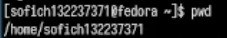

## 

Перехожу в каталог tmp и просматриваю его содержимое

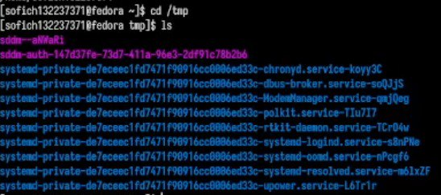

## 

Использую команду ls  с опцией l, которая позволит увидет дополнительную информацию о файлах

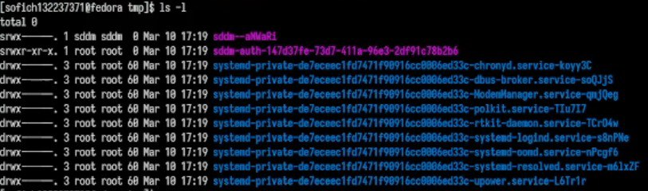

##

Использую команду ls  с опцией a, которая показывает скрытые файлы в каталоге 

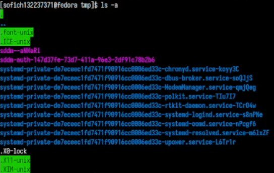

##

Определяю,есть ли в каталоге /var/spool подкаталог cron

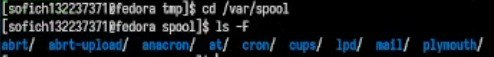

##

Возвращаюсь в домашний каталог и проверяю все его содержимое командой ls  с опцией l,которя поможет определить владельца файлов, -a,которая показывает содержимое каталога, и -F,которая поможет определить что из содержимого каталог, а что файл.

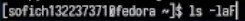

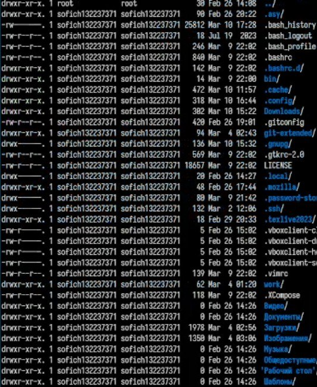
##

В домашнем каталоге создает подкаталог newdir 

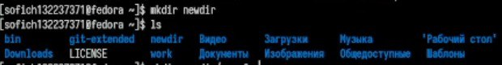

##

Создаю каталог morefun в каталоге ~/newdir  

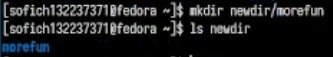

##

В домашнем каталоге создаю одной командой три новых каталога с именами letters, memos, misk. 

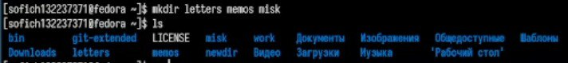

##

Удаляю их 

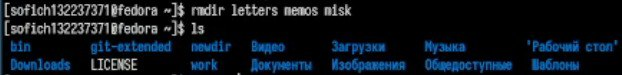

##

Удаляю ранее созданный каталог ~/newdir командой rm. Так он не удаляется,поэтому применяю команду rmdir.

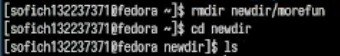

##

Удаляю каталог ~/newdir/morefun из домашнего каталога. Проверяю, был ли каталог удалён.

##
С помощью команды man определяю, какую опцию команды ls нужно использовать для просмотра содержимого не только указанного каталога, но и подкаталогов,входящих в него. Это -R.

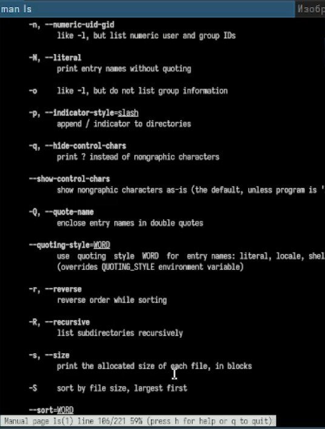

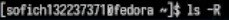{#fig:015 width=70%}

##

Запускаю команду 

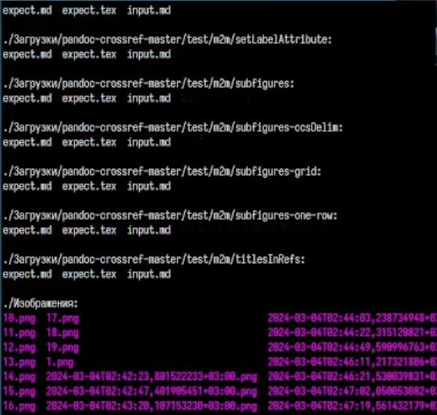

##

С помощью команды man определяю набор опций команды ls, позволяющий отсортировать по времени последнего изменения выводимый список содержимого каталога с развёрнутым описанием файлов. Это -lt.

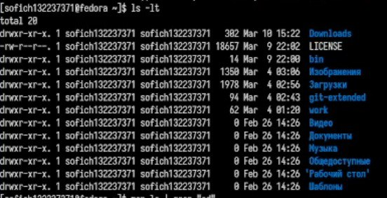

##

С помощью man cd узнаю описание команды cd и ее опции. Основных опций немного.

  1. -P - позволяет следовать по символическим ссылкам перед тем, как обработаны все переходы '..'
  2.-L - переходит по символическим ссылкам только после того, как обработаны все переходы ".."
  3.-e - позволяет выйти с ошибкой, если диреткория, в которую нужно перейти, не найдена.

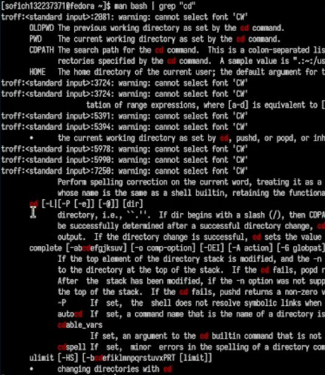

##

С помощью man pwd узнаю описание команды pwd и ее опции 

 1.-L - брать директорию из переменной окружения, даже если она содержит символические ссылки.
 2.-P - отбрасывать все символические ссылки.

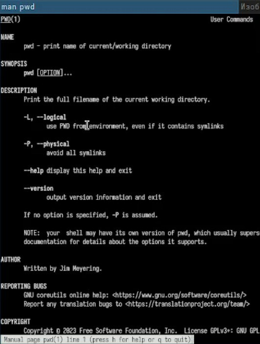

##

С помощью man mkdir узнаю описание команды mkdir и ее опции 

 1.-m - устанавливает права доступа создаваемой директории как chmod, синтаксис тоже как у chmod.
 2. -p - позволяет рекурсивно создавать директории и их подкаталоги
 3. -v - выводи сообщение о созданных директориях
 4. -z - установить контекст SELinux для создаваемой директории по умолчанию
 5. -context - установить контекст SELinux для создаваемой директории в значении CTX

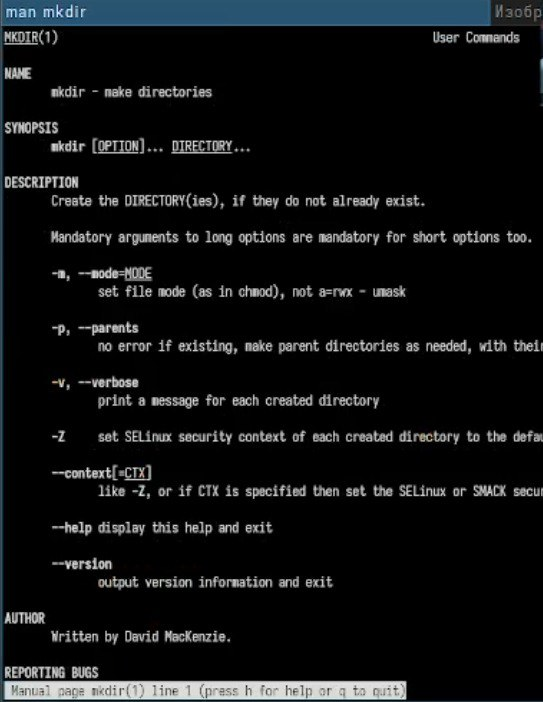

##

Запускаю команду history.

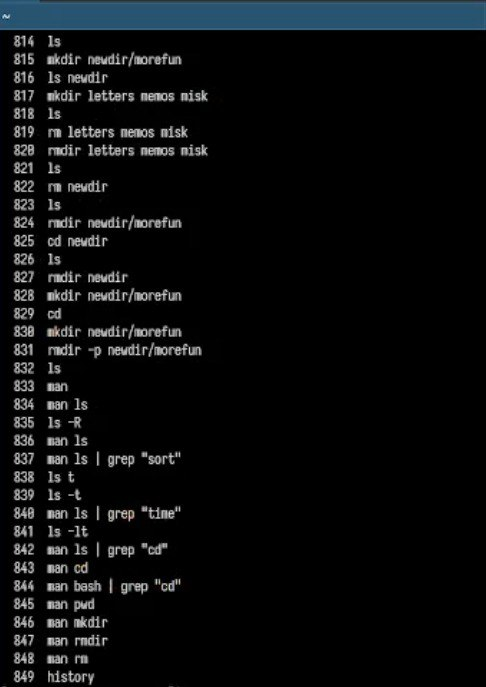

##

Модифицирую команду.

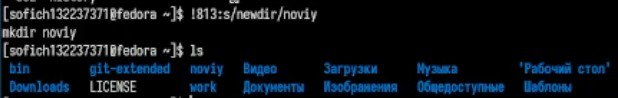

##

Модифицирую команду.

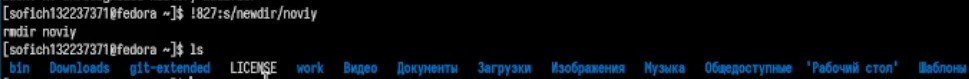

# Ответы на контрольные вопросы

##

1.Командная строка - это текстовая система, которая передает команды компьютеру и возвращает результаты пользователю. В операционной системе типа Linux взаимодействие пользователя с системой обычно осуществляется с помощью командной строки посредством построчного ввода команд.
2.Для определения абсолютного пути к текущему каталогу используется команда pwd. Например: если я введу pwd в своем домашнем каталоге то получу /home/evdvorkina
3.С помощью команды ls можно определить имена файлов, при помощи опции -F уже мы сможем определить тип файлов, если нам необходимы скрытые файлы, добавим опцию -a. Пример есть в лабораторной работе.
4.С помощью команды ls можно определить имена файлов, если нам необходимы скрытые файлы, добавим опцию -a. Пример есть в лабораторной работе.
rmdir по умолчанию удаляет пустые каталоги, не удаляет файлы. rm удаляет файлы, без дополнительных опций (-d, -r) не будет удалять каталоги. Удалить в одной строчке одной командой можно файл и каталог. Если файл находится в каталоге, используем рекурсивное удаление, если файл и каталог не связаны подобным образом, то добавим опцию -d, введя имена через пробел после утилиты.
5.Вывести информацию о последних выполненных пользователем команд можно с помощью history. Пример приведет в лабораторной работе.
6.Используем синтаксиси !номеркоманды в выводе history:s/что заменяем/на что заменяем Примеры приведены в лабораторной работе.
7.Предположим, я нахожусь не в домашнем каталоге. Если я введу "cd ; ls", то окажусь в домашнем каталоге и получу вывод файлов внутри него.
8.Символ экранирования - (обратный слеш) добавление перед спецсимволом обратный слеш, чтобы использовать специальный символ как обычный. Также позволяет читать системе название директорий с пробелом. Пример: cd work/Операционные\ системы/
9.Опция -l позволит увидеть дополнительную информацию о файлах в каталоге: время создания, владельца, права доступа
10.Относительный путь к файлу начинается из той директории, где вы находитесь (она сама не прописывается в пути), он прописывается относительно данной директории. Абсолютный путь начинается с корневого каталога.
11.Использовать man <имя команды> или <имя команды> --help
12.Клавиша Tab.

## Выводы

Я приобрел практические навыки взаимодействия пользователя с системой посредством командной строки.

## Список литературы{.unnumbered}

 Лабораторная работа №6

