---
## Front matter
lang: ru-RU
title: Презентация по лабораторной работе №8
subtitle: Поиск файлов. Перенаправление ввода-вывода. Просмотр запущенных процессов
author:
  - Софич А.С
institute:
  - Российский университет дружбы народов, Москва, Россия
  - НКАбд-05-23
date: 04 марта 2024

## i18n babel
babel-lang: russian
babel-otherlangs: english

## Formatting pdf
toc: false
toc-title: Содержание
slide_level: 2
aspectratio: 169
section-titles: true
theme: metropolis
header-includes:
 - \metroset{progressbar=frametitle,sectionpage=progressbar,numbering=fraction}
 - '\makeatletter'
 - '\beamer@ignorenonframefalse'
 - '\makeatother'

## Fonts
mainfont: PT Serif
romanfont: PT Serif
sansfont: PT Sans
monofont: PT Mono
mainfontoptions: Ligatures=TeX
romanfontoptions: Ligatures=TeX
sansfontoptions: Ligatures=TeX,Scale=MatchLowercase
monofontoptions: Scale=MatchLowercase,Scale=0.9
---

## Докладчик

:::::::::::::: {.columns align=center}
::: {.column width="70%"}

  * Софич Андрей Геннадьевич
  * Студент
  * НКАбд-05-23
  * Российский университет дружбы народов
  * [1132237371@pfur.ru](mailto:1132237371@rudn.ru)

:::
::: {.column width="30%"}

:::
::::::::::::::

## Цели и задачи

Ознакомление с инструментами поиска файлов и фильтрации текстовых данных.
Приобретение практических навыков: по управлению процессами (и заданиями), по
проверке использования диска и обслуживанию файловых систем.

# Выполнение лабораторной работы

## 

Вхожу в систему,используя соответствующее имя пользователя. С помощью перенапраления ">" добавляю в файл file.txt название файлов из /etc. С помощью команды head проверяю первые 10 строк файла 

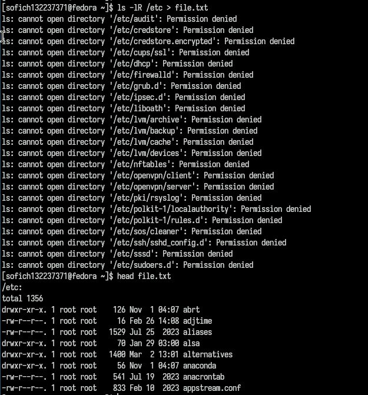

##

Добавляю в файл имена из домашнего каталога

##

Проверяю файл file.txt

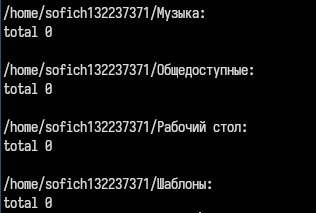

##

Вывожу на экран имена всех файлов,содержащих расщирение .conf, с помощию команды grep 

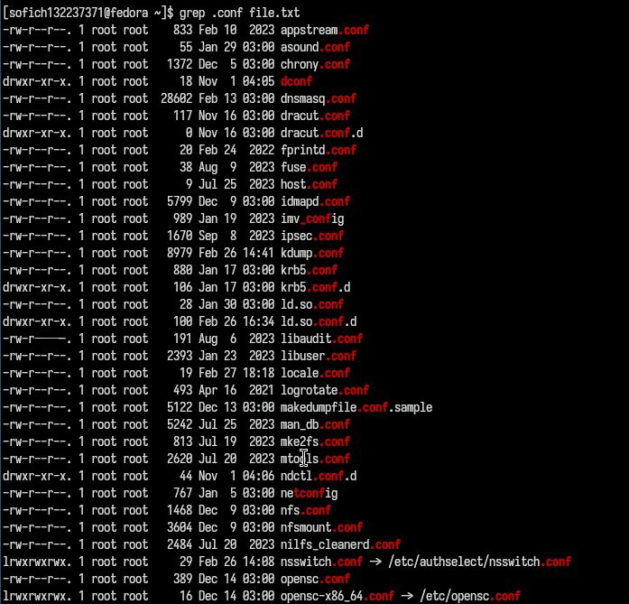

##

Записываю найденные файлы в новый файл 

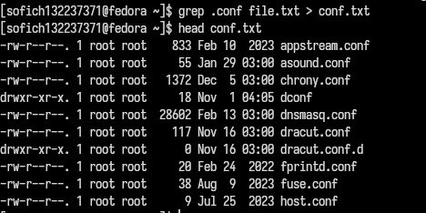

##

Нахожу в домашнем каталоге все файлы,которые начинаются на "c" 

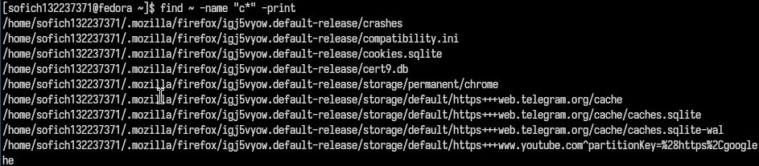

##

Еще один способ найти элементы с первым символов. Однако этот способ не работает для поиска файлов из подкаталогов 

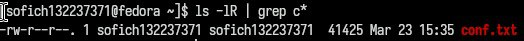

##

С помощью опции find, вывожу на экран имена файлов из каталог /etc,начинающихся с символа h  

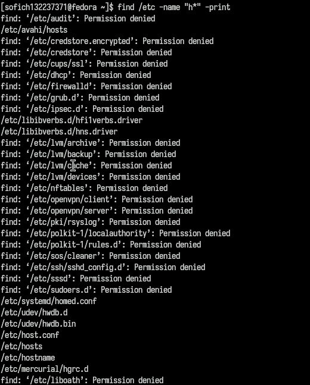

##

Запускаю в фоновом режиме процесс, который будет записывать в файл ~/logfile файлы, имена которых начинаются с log. 

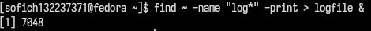

##

Проверяю,что файл создан и удаляю его 

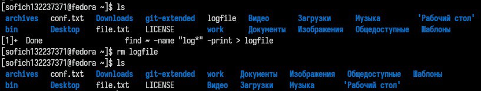

##

Запускаю в фоновом режиме редактор mousepad, так как редактора gedit у меня нет 

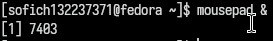

##

Определяю идентификатор процесса mousepad, используя команду ps, конвейер и фильтр grep.

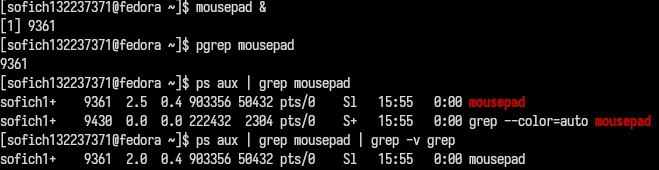

##

Изучаю справку команды kill 

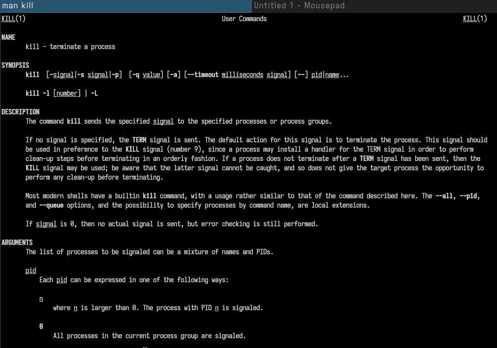

##

Удаляю процесс 

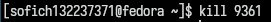

##

Изучаю справку команды df и выполняю её,использовав утилиту -iv, которая позволяет увидеть информацию об инодах и сделать вывод читаемым.игнорирую сообщение системы о нем,так мы узнаем,сколько у нашей системы места 

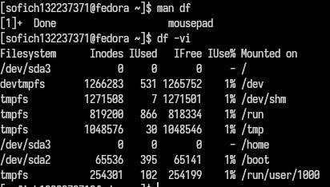

##

Изучаю справку команды du и выполняю её,использовав утилиту -а,которая позволяет увидеть,сколько памяти занимают все файлы 

##

Выполняю команду du 

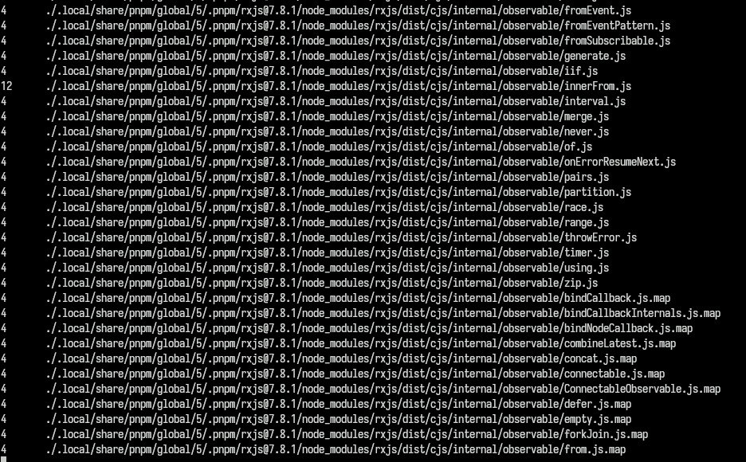

##

Вывела имена всех директорий, имеющихся в моем домашнем каталоге, используя аргумент d у утилиты find опции -туре, то есть указываю тип файлов,который мне нужен и этот тип Директория. Утилита -а позволит увидеть размер всех файлов, а не только диреткорий 

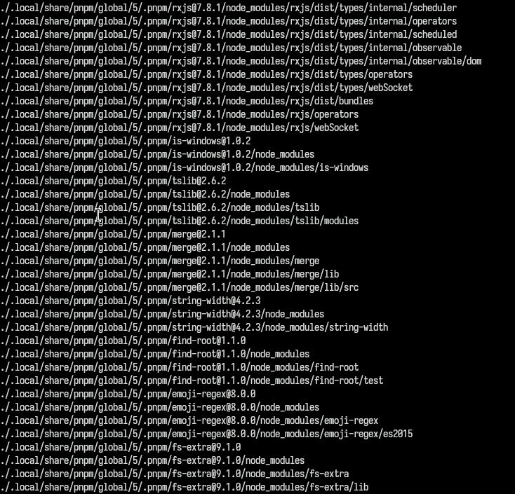

## Выводы

Я ознакомлся с инструментами поиска файлов и фильтрации текстовых данных,приобрел практические навыки: по управлению процессами (и заданиями), попроверке использования диска и обслуживанию файловых систем.

