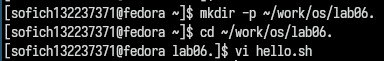
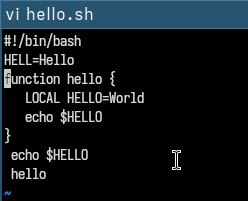
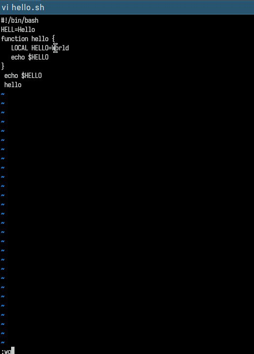
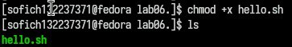
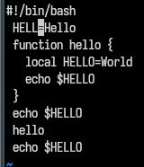
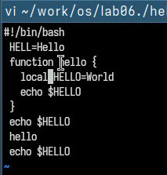
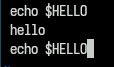
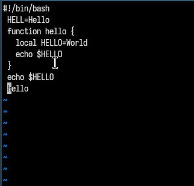
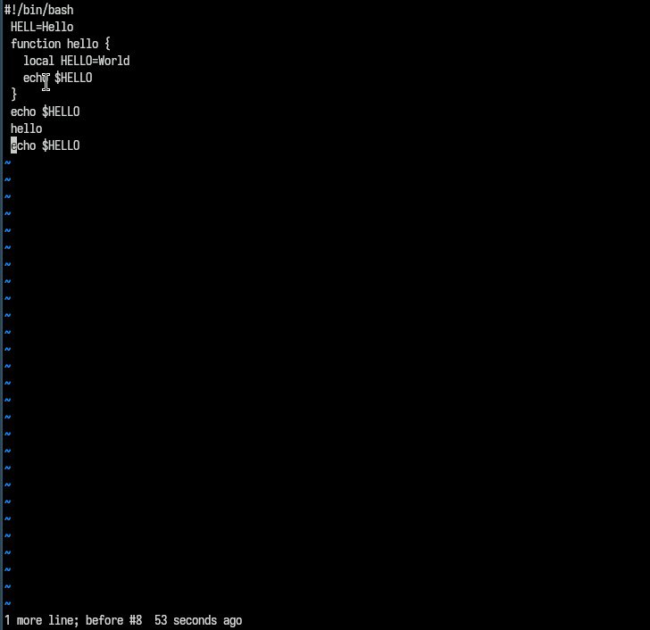
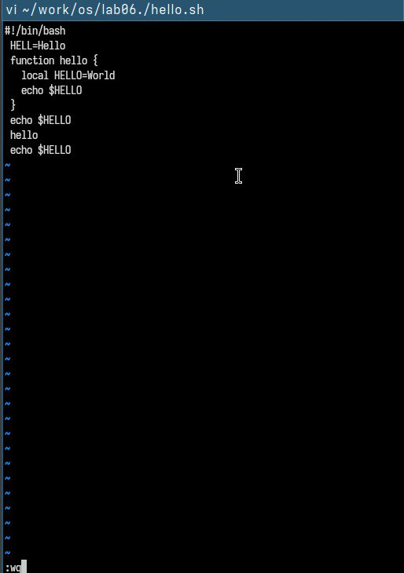

---
## Front matter
lang: ru-RU
title: Презентация по лабораторной работе №10
subtitle: Текстовый редактор vi
author:
  - Софич А.С
institute:
  - Российский университет дружбы народов, Москва, Россия
  - НКАбд-05-23
date: 04 марта 2024

## i18n babel
babel-lang: russian
babel-otherlangs: english

## Formatting pdf
toc: false
toc-title: Содержание
slide_level: 2
aspectratio: 169
section-titles: true
theme: metropolis
header-includes:
 - \metroset{progressbar=frametitle,sectionpage=progressbar,numbering=fraction}
 - '\makeatletter'
 - '\beamer@ignorenonframefalse'
 - '\makeatother'

## Fonts
mainfont: PT Serif
romanfont: PT Serif
sansfont: PT Sans
monofont: PT Mono
mainfontoptions: Ligatures=TeX
romanfontoptions: Ligatures=TeX
sansfontoptions: Ligatures=TeX,Scale=MatchLowercase
monofontoptions: Scale=MatchLowercase,Scale=0.9
---

## Докладчик

:::::::::::::: {.columns align=center}
::: {.column width="70%"}

  * Софич Андрей Геннадьевич
  * Студент
  * НКАбд-05-23
  * Российский университет дружбы народов
  * [1132237371@pfur.ru](mailto:1132237371@rudn.ru)

:::
::: {.column width="30%"}

:::
::::::::::::::

## Цели и задачи

Познакомиться с операционной системой LINUX. Получить практические навыки работы с редактором vi,установленным по умолчанию.

# Выполнение лабораторной работы

## 

Создаю каталог ~/work/os/lab06., используя ключ -р, перехожу в новую директорию, вызываю vi и создаю новый файл hello.sh

## 

Нажимаю клавишу "i" и ввожу текст

## 

Нажимаю клавишу esc для перехода в командный режим, нажимаю : для перехода в режим последней строки, нажимаю mq для записи и выхода,после чего подтверждаю действия,нажав enter

##

Создаю исполняемый файл

##

Вызываю vi на редактирование файла,перехожу в режим вставки и меняю HELL на HELLO 

##

Перехожу на 4 строку файла и меняю LOCAL на local, возвращаюся в командный режим

## 

Перехожу на последную строку файла и вписываю текст: echo $HELLO 

##

Перехожу в командный режим, и перед последней строкой прописываю "dd", удаляю эту строку

##

Ввожу команду отмены изменений "u"

##

Нажимаю : для перехода в режим последней строки, нажимаю mq для записи и ывхода,после чего подтверждаю действия,нажав enter

## Выводы

В ходе работы я полученил практические навыки работы с редактором vi,установленным по умолчанию.

