---
## Front matter
title: "Индивидуальный проект №1"
subtitle: "Опереционные системы"
author: "Софич Андрей Геннадьевич"

## Generic otions
lang: ru-RU
toc-title: "Содержание"

## Bibliography
bibliography: bib/cite.bib
csl: pandoc/csl/gost-r-7-0-5-2008-numeric.csl

## Pdf output format
toc: true # Table of contents
toc-depth: 2
lof: true # List of figures
fontsize: 12pt
linestretch: 1.5
papersize: a4
documentclass: scrreprt
## I18n polyglossia
polyglossia-lang:
  name: russian
  options:
	- spelling=modern
	- babelshorthands=true
polyglossia-otherlangs:
  name: english
## I18n babel
babel-lang: russian
babel-otherlangs: english
## Fonts
mainfont: PT Serif
romanfont: PT Serif
sansfont: PT Sans
monofont: PT Mono
mainfontoptions: Ligatures=TeX
romanfontoptions: Ligatures=TeX
sansfontoptions: Ligatures=TeX,Scale=MatchLowercase
monofontoptions: Scale=MatchLowercase,Scale=0.9
## Biblatex
biblatex: true
biblio-style: "gost-numeric"
biblatexoptions:
  - parentracker=true
  - backend=biber
  - hyperref=auto
  - language=auto
  - autolang=other*
  - citestyle=gost-numeric
## Pandoc-crossref LaTeX customization
figureTitle: "Рис."
tableTitle: "Таблица"
listingTitle: "Листинг"
lofTitle: "Список иллюстраций"
lolTitle: "Листинги"
## Misc options
indent: true
header-includes:
  - \usepackage{indentfirst}
  - \usepackage{float} # keep figures where there are in the text
  - \floatplacement{figure}{H} # keep figures where there are in the text
---

# Цель работы

Цель работы-научиться создать нужную основу для сайта через github

# Задание

Создать базу для сайта

# Выполнение проекта

Устанавливаем архив с файлом hugo, разархивируем его и перемещаем исполняемый файл в папку /usr/local/bin (рис. [-@fig:001]).

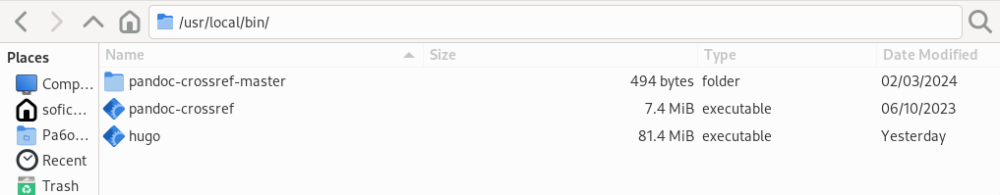{#fig:001 width=70%}

Создаем репозиторий на основе шаблона в github (рис. [-@fig:002]). 

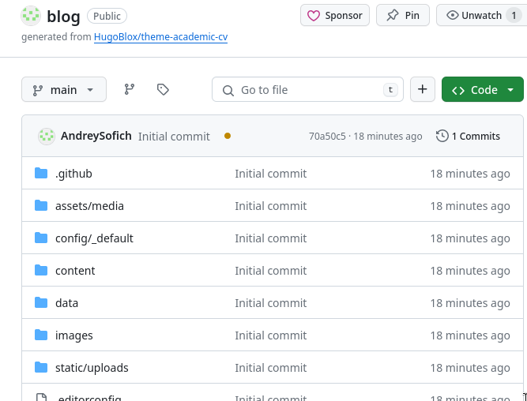{#fig:002 width=70%}
 
Клонируем репозиторий по ссылке в директорию work (рис. [-@fig:003]).

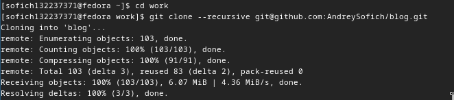{#fig:003 width=70%}

Запускаем исполняемый файл hugo (рис. [-@fig:004]).

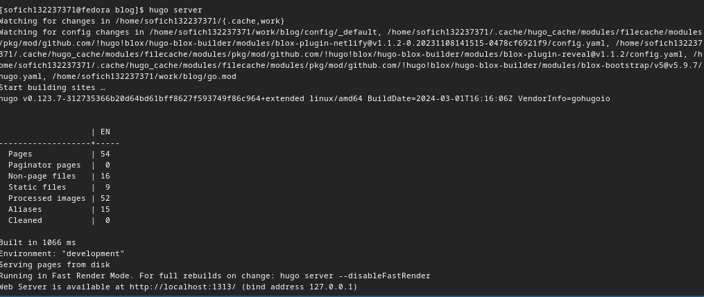{#fig:004 width=70%}

Переходим по ссылке и открываем основной сайт (рис. [-@fig:005]).

{#fig:005 width=70%}

Создаем новый репозиторий с названием AndreySofich.github.io (рис. [-@fig:006]).

{#fig:006 width=70%}

Клонируем пустой репозиторий по ссылке в директорию work (рис. [-@fig:007]).

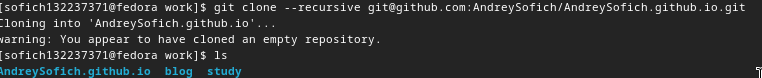{#fig:007 width=70%}

Переходим на ветку main и создаем файл README.md, отправляем все на GitHub (рис. [-@fig:008]).

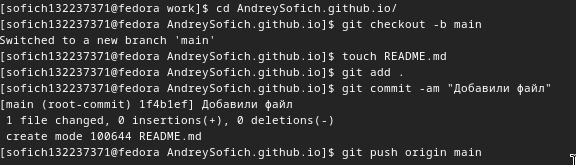{#fig:008 width=70%}

Задаем из основного репозитория для проекта индекс для "io", это будет паапка public (рис. [-@fig:009]).

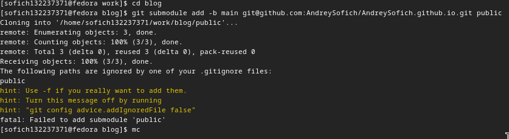{#fig:009 width=70%}

Закомментируем public (рис. [-@fig:010]).

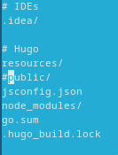{#fig:010 width=70%}

Повторяем команду, созадем индекс (рис. [-@fig:011]).

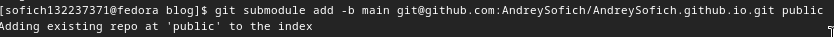{#fig:011 width=70%}

Запускаем исполняемый файл hugo (рис. [-@fig:012]).

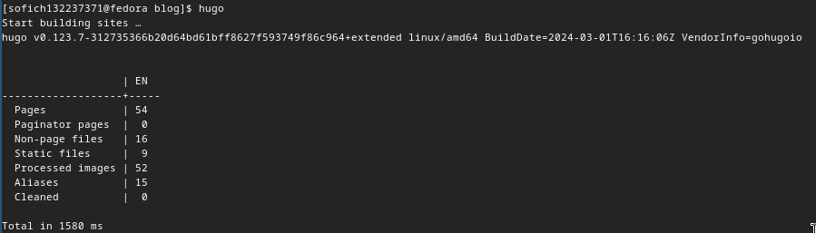{#fig:012 width=70%}

Перехожу в папку puplic, проверяю к какому репозиторию она подгружена (рис. [-@fig:013]).

{#fig:013 width=70%}

Добавляем изменения (рис. [-@fig:014]).

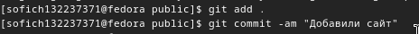{#fig:014 width=70%}

Отправляю всё на ветку main (рис. [-@fig:015]).

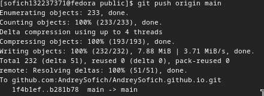{#fig:015 width=70%}

Проверяю репозиторий с добавленными файлами (рис. [-@fig:016]).

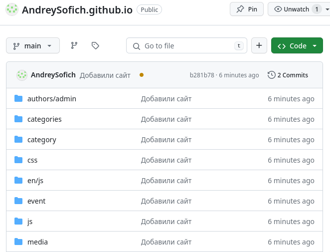{#fig:016 width=70%}

Проверяю сайт по новой ссылке (рис. [-@fig:017]).

{#fig:017 width=70%}

# Выводы

Я научился создавать базу сайта с помощью работы с git.

