---
## Front matter
lang: ru-RU
title: Презентация по проекту №2
subtitle: Операционные системы
author:
  - Софич А.С
institute:
  - Российский университет дружбы народов, Москва, Россия
  - НКАбд-05-23
date: 29 февраля 2024

## i18n babel
babel-lang: russian
babel-otherlangs: english

## Formatting pdf
toc: false
toc-title: Содержание
slide_level: 2
aspectratio: 169
section-titles: true
theme: metropolis
header-includes:
 - \metroset{progressbar=frametitle,sectionpage=progressbar,numbering=fraction}
 - '\makeatletter'
 - '\beamer@ignorenonframefalse'
 - '\makeatother'

## Fonts
mainfont: PT Serif
romanfont: PT Serif
sansfont: PT Sans
monofont: PT Mono
mainfontoptions: Ligatures=TeX
romanfontoptions: Ligatures=TeX
sansfontoptions: Ligatures=TeX,Scale=MatchLowercase
monofontoptions: Scale=MatchLowercase,Scale=0.9
---

## Докладчик

:::::::::::::: {.columns align=center}
::: {.column width="70%"}

  * Софич Андрей Геннадьевич
  * Студент
  * НКАбд-05-23
  * Российский университет дружбы народов
  * [1132237371@pfur.ru](mailto:1132237371@rudn.ru)

:::
::: {.column width="30%"}

:::
::::::::::::::

## Цели и задачи

Нучиться добавлять данные на сайт

# Выполнение лабораторной работы

## 

Перхожу в дирректорию blog/content/authors и меня. фотографию на ту,которую хочу видеть на сайте 

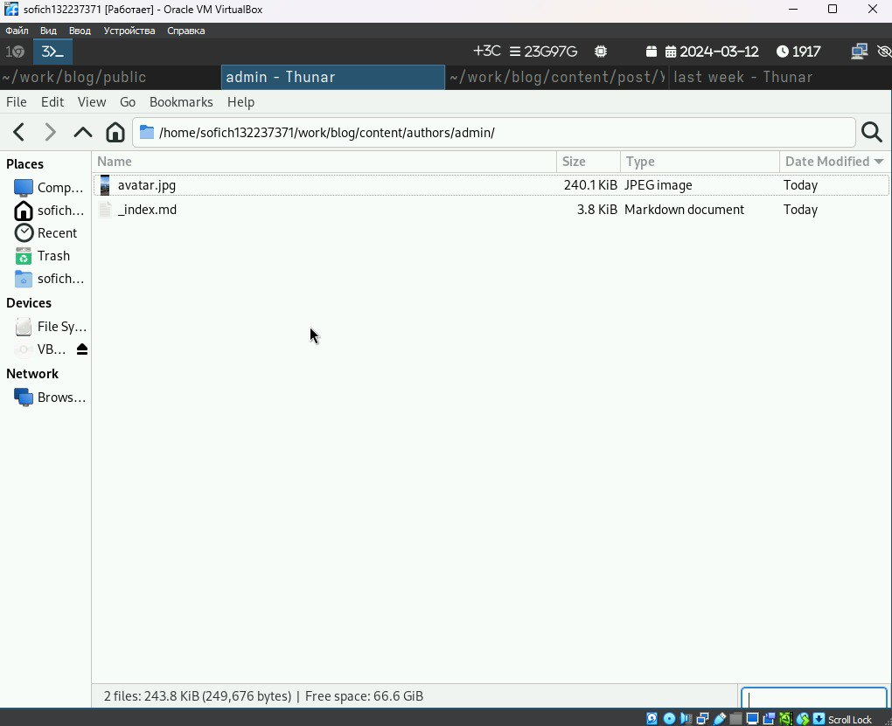

##

В том же каталоге захожу в index.md и начинаю менять файл, вводя информацию о себе. 

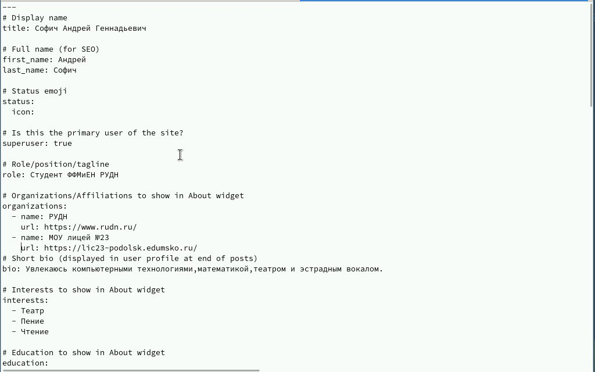
 
##

Добавляю информацию об образовании, увлечениях и мини-биографию.

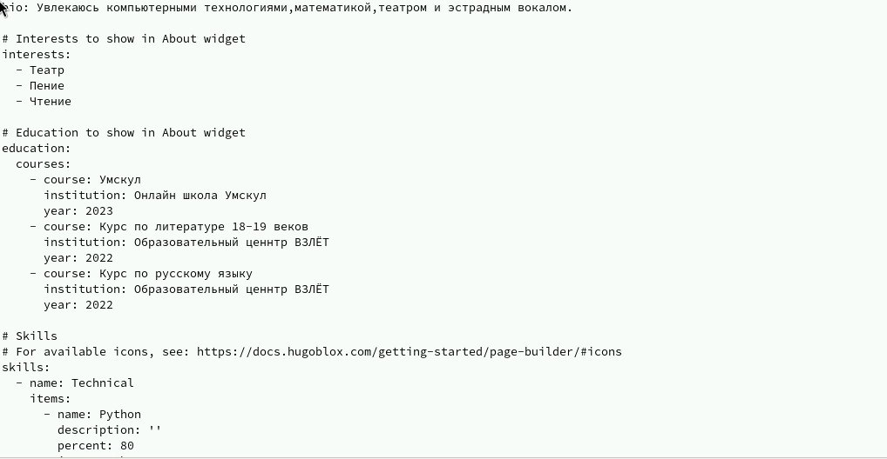

##

Проверяю сайт, использовав локальную ссылку.

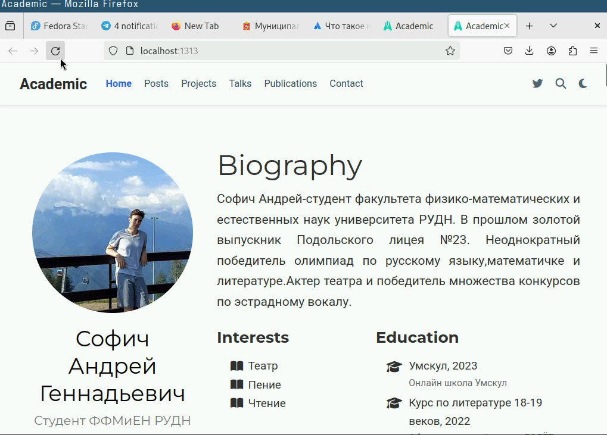

##

Переходим в каталог post/last week, в созданный файл.

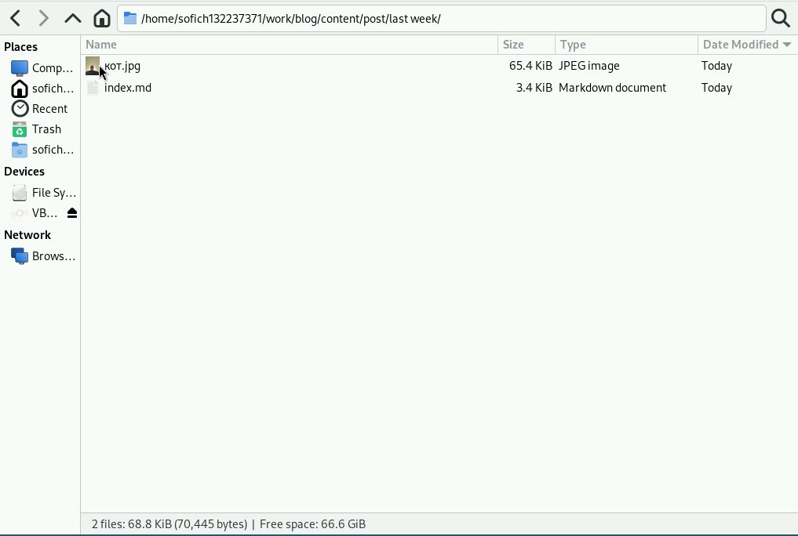

##

Редактируем файл, пишем пост .

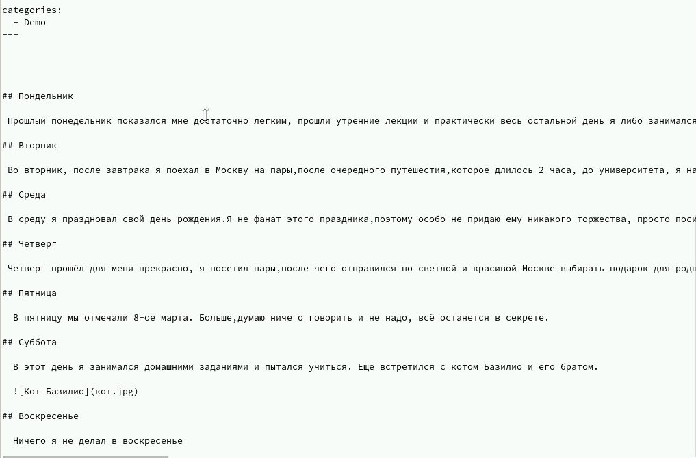

##

Переходим в папку с другим постом, пишем его.

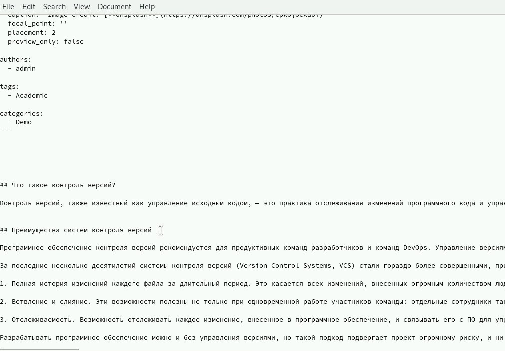

##

Проверяем изменения .

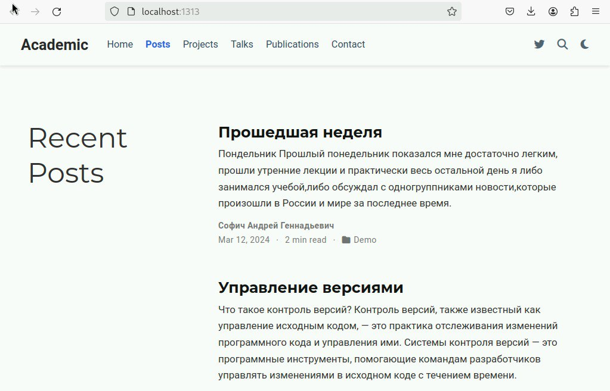

##

Переходим в blog и прописываем изменения, использовав hugo .

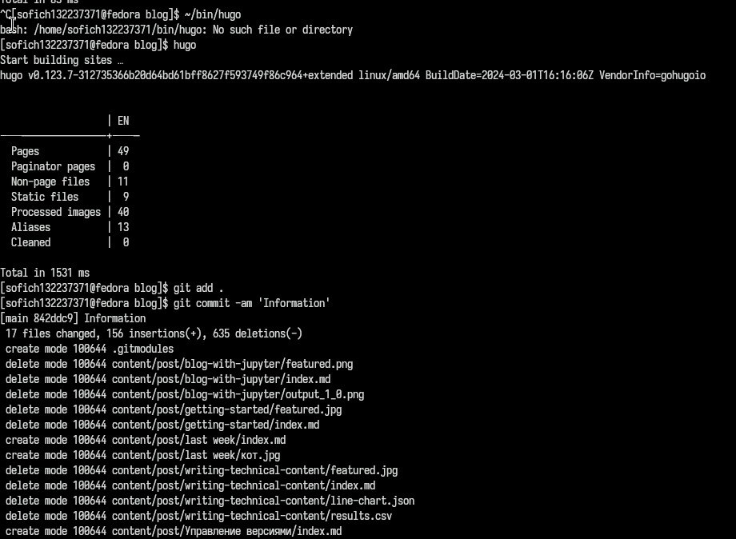

##

Отправляем изменения на гит.

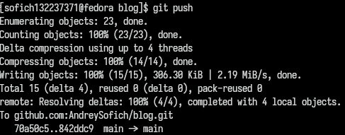

##

Добавляем изменения и отправляем их на гит через папку public.

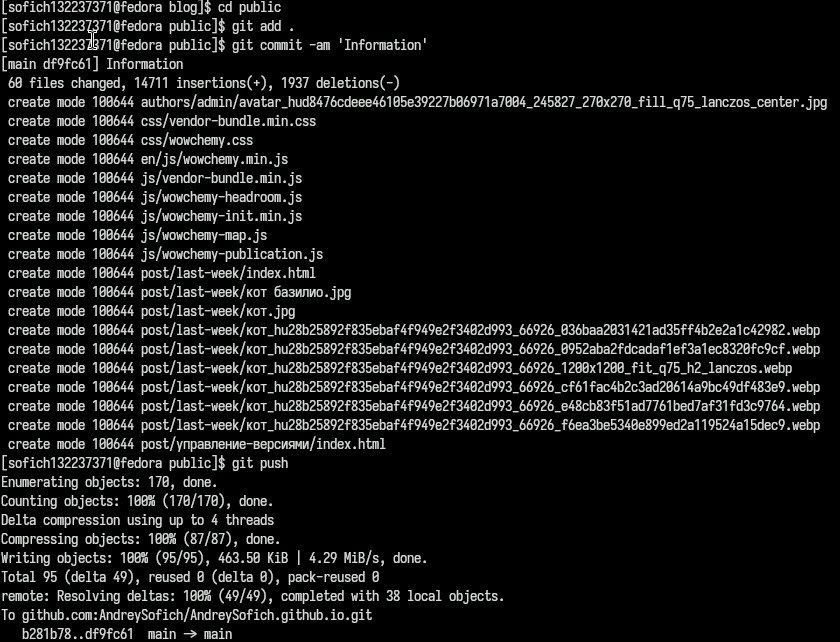

## Выводы

Я научился создавать базу сайта с помощью работы с git.
