---
## Front matter
title: "Индивидуальный проект №2"
subtitle: "Опереционные системы"
author: "Софич Андрей Геннадьевич"

## Generic otions
lang: ru-RU
toc-title: "Содержание"

## Bibliography
bibliography: bib/cite.bib
csl: pandoc/csl/gost-r-7-0-5-2008-numeric.csl

## Pdf output format
toc: true # Table of contents
toc-depth: 2
lof: true # List of figures
fontsize: 12pt
linestretch: 1.5
papersize: a4
documentclass: scrreprt
## I18n polyglossia
polyglossia-lang:
  name: russian
  options:
	- spelling=modern
	- babelshorthands=true
polyglossia-otherlangs:
  name: english
## I18n babel
babel-lang: russian
babel-otherlangs: english
## Fonts
mainfont: PT Serif
romanfont: PT Serif
sansfont: PT Sans
monofont: PT Mono
mainfontoptions: Ligatures=TeX
romanfontoptions: Ligatures=TeX
sansfontoptions: Ligatures=TeX,Scale=MatchLowercase
monofontoptions: Scale=MatchLowercase,Scale=0.9
## Biblatex
biblatex: true
biblio-style: "gost-numeric"
biblatexoptions:
  - parentracker=true
  - backend=biber
  - hyperref=auto
  - language=auto
  - autolang=other*
  - citestyle=gost-numeric
## Pandoc-crossref LaTeX customization
figureTitle: "Рис."
tableTitle: "Таблица"
listingTitle: "Листинг"
lofTitle: "Список иллюстраций"
lolTitle: "Листинги"
## Misc options
indent: true
header-includes:
  - \usepackage{indentfirst}
  - \usepackage{float} # keep figures where there are in the text
  - \floatplacement{figure}{H} # keep figures where there are in the text
---

# Цель работы

Нучиться добавлять данные на сайт

# Задание

Добавить к сайту данный о себе и сделать посты

# Выполнение проекта

Перхожу в дирректорию blog/content/authors и меня. фотографию на ту,которую хочу видеть на сайте (рис. [-@fig:001]).

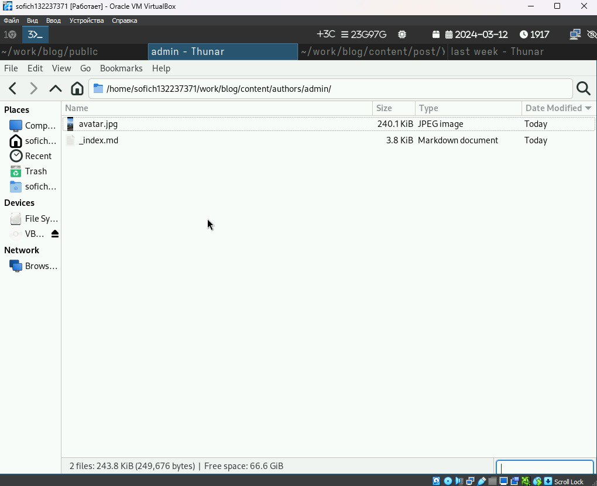{#fig:001 width=70%}

В том же каталоге захожу в index.md и начинаю менять файл, вводя информацию о себе (рис. [-@fig:002]). 

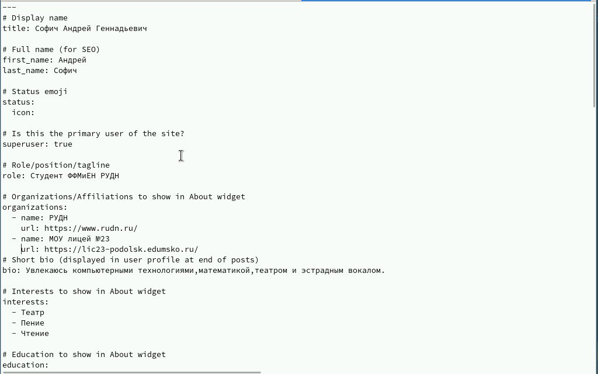{#fig:002 width=70%}
 
Добавляю информацию об образовании, увлечениях и мини-биографию (рис. [-@fig:003]).

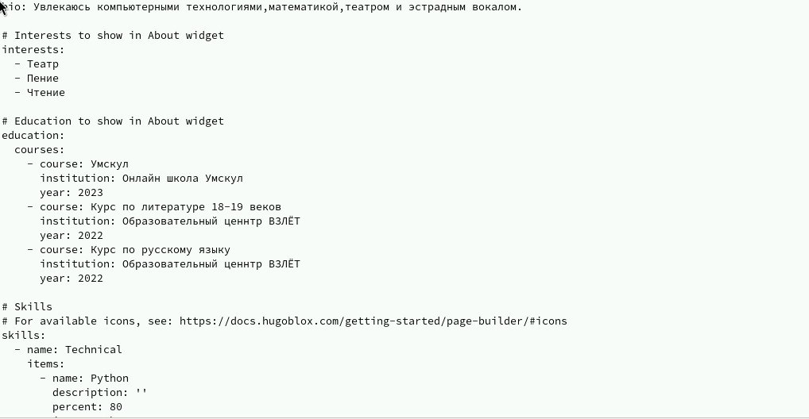{#fig:003 width=70%}

Проверяю сайт, использовав локальную ссылку  (рис. [-@fig:004]).

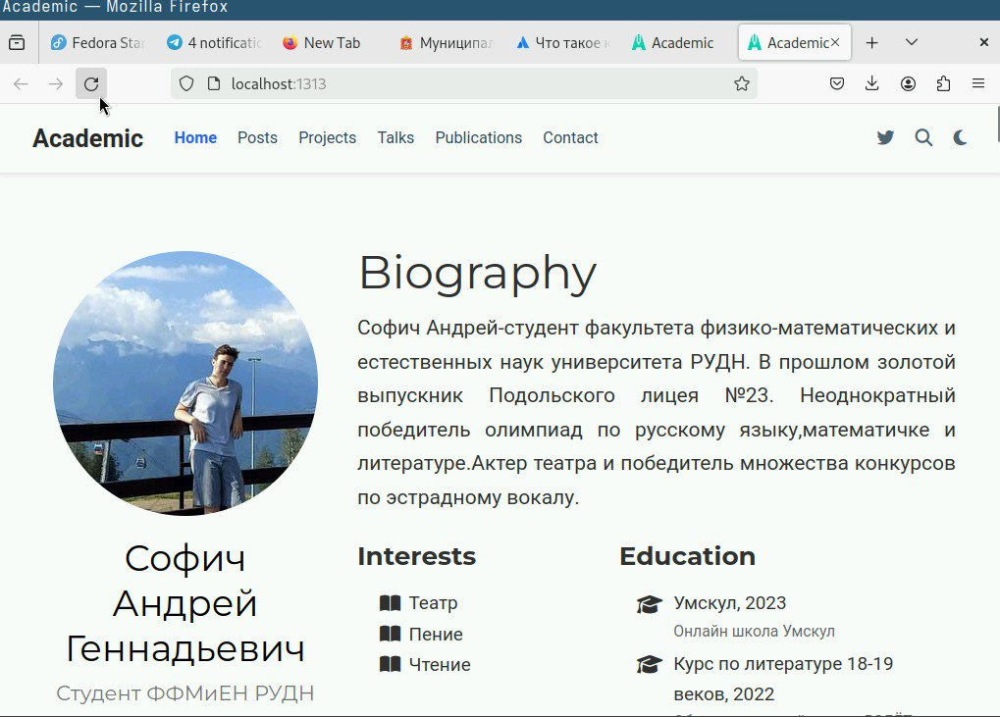{#fig:004 width=70%}

Переходим в каталог post/last week, в созданный файл (рис. [-@fig:005]).

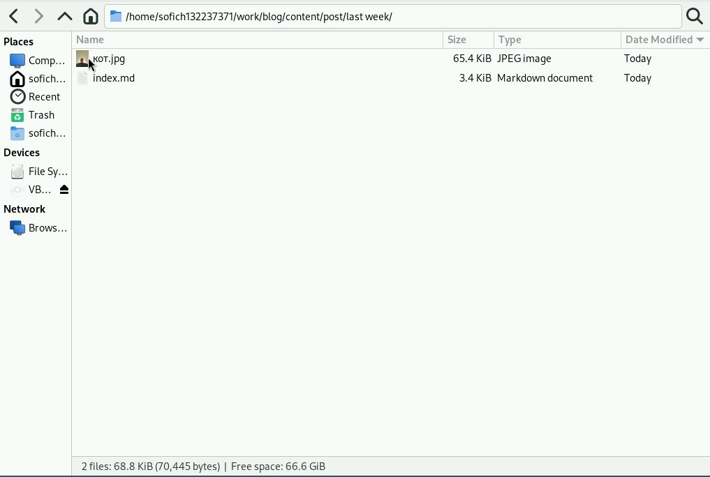{#fig:005 width=70%}

Редактируем файл, пишем пост (рис. [-@fig:006]).

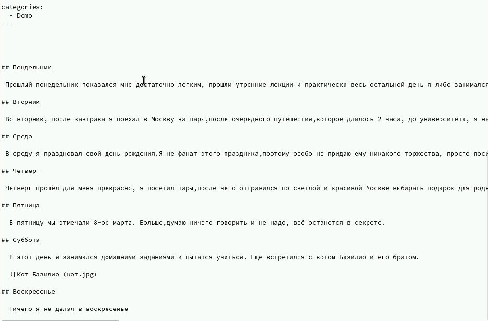{#fig:006 width=70%}

Переходим в папку с другим постом, пишем его (рис. [-@fig:007]).

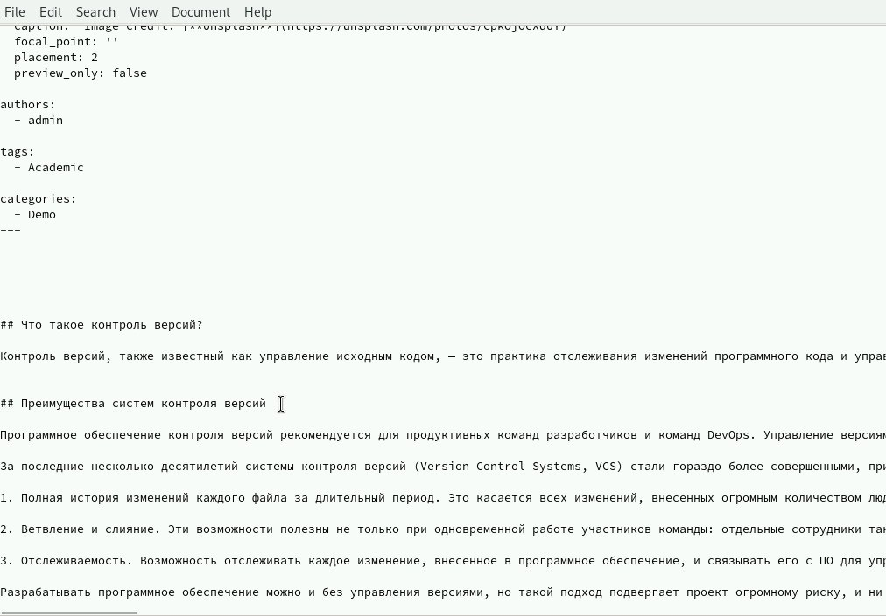{#fig:007 width=70%}

Проверяем изменения (рис. [-@fig:008]).

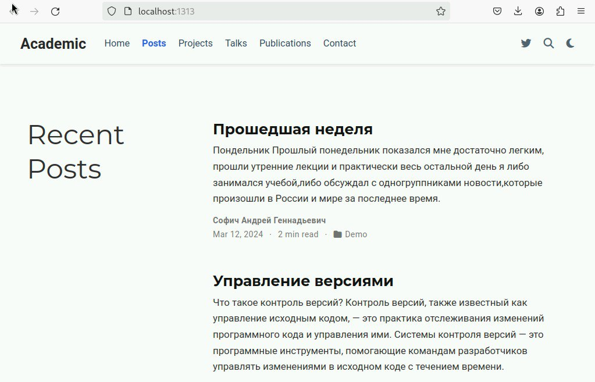{#fig:008 width=70%}

Переходим в blog и прописываем изменения, использовав hugo (рис. [-@fig:09]).

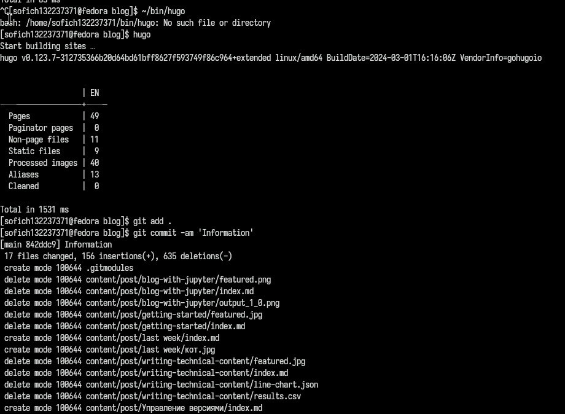{#fig:09 width=70%}

Отправляем изменения на гит (рис. [-@fig:010]).

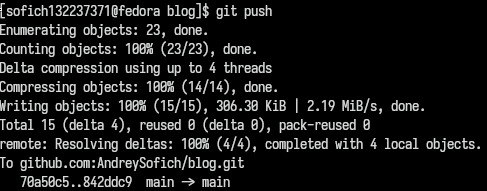{#fig:010 width=70%}

Добавляем изменения и отправляем их на гит через папку public (рис. [-@fig:011]).

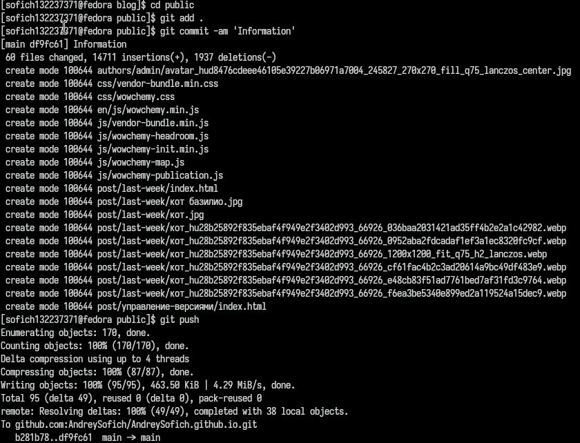{#fig:011 width=70%}

# Выводы

Я научился добавлять данные на сайт
