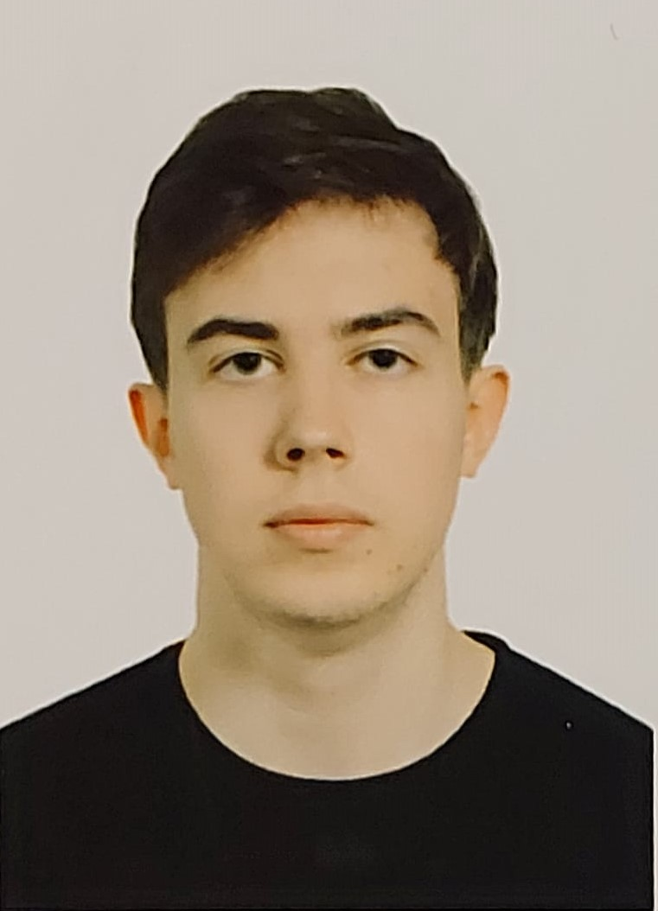
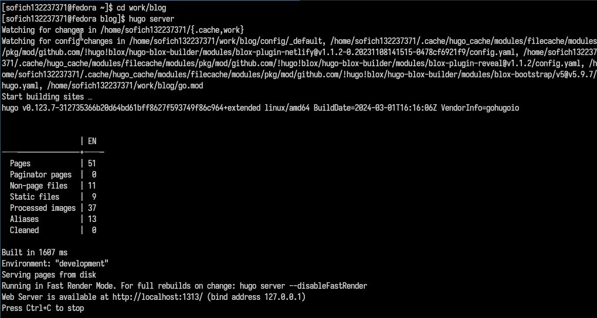
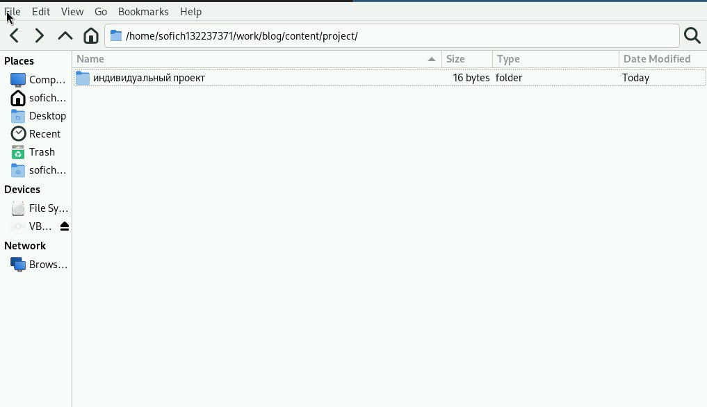
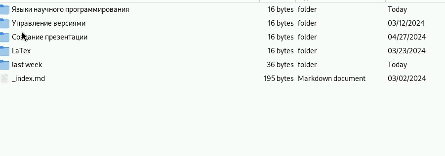
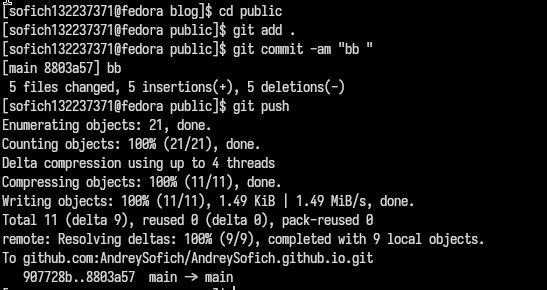
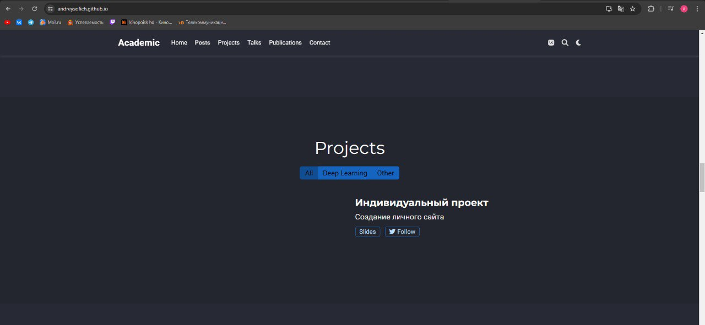

---
## Front matter
lang: ru-RU
title: Презентация по проекту №5
subtitle: Операционные системы
author:
  - Софич А.С
institute:
  - Российский университет дружбы народов, Москва, Россия
  - НКАбд-05-23
date: 27 апреля 2024

## i18n babel
babel-lang: russian
babel-otherlangs: english

## Formatting pdf
toc: false
toc-title: Содержание
slide_level: 2
aspectratio: 169
section-titles: true
theme: metropolis
header-includes:
 - \metroset{progressbar=frametitle,sectionpage=progressbar,numbering=fraction}
 - '\makeatletter'
 - '\beamer@ignorenonframefalse'
 - '\makeatother'

## Fonts
mainfont: PT Serif
romanfont: PT Serif
sansfont: PT Sans
monofont: PT Mono
mainfontoptions: Ligatures=TeX
romanfontoptions: Ligatures=TeX
sansfontoptions: Ligatures=TeX,Scale=MatchLowercase
monofontoptions: Scale=MatchLowercase,Scale=0.9
---

## Докладчик

:::::::::::::: {.columns align=center}
::: {.column width="70%"}

  * Софич Андрей Геннадьевич
  * Студент
  * НКАбд-05-23
  * Российский университет дружбы народов
  * [1132237371@pfur.ru](mailto:1132237371@rudn.ru)

:::
::: {.column width="30%"}

:::
::::::::::::::

## Цели и задачи

Создать проект на сайт

# Выполнение лабораторной работы

## 

Перхожу в дирректорию blog и перехожу по локальной ссылке.

##

Перехожу в папку с проектами и создаю новый проект.

##
 
Добавляю посты о предыдущей неделе и пост, о языках программирования.

##

Отправляю все изменения.

##

Отправляю все изменения. 

##

Проверяю выполнение, используя официальную ссылку.

## Выводы

Я научился добавлять проекты на сайт
